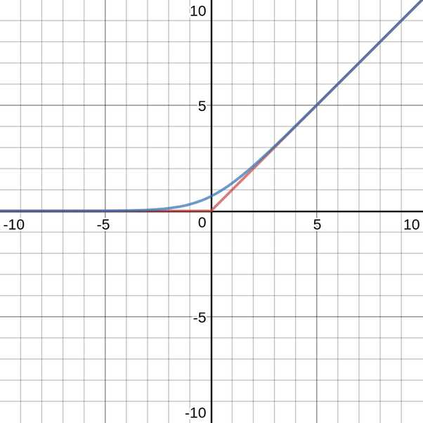
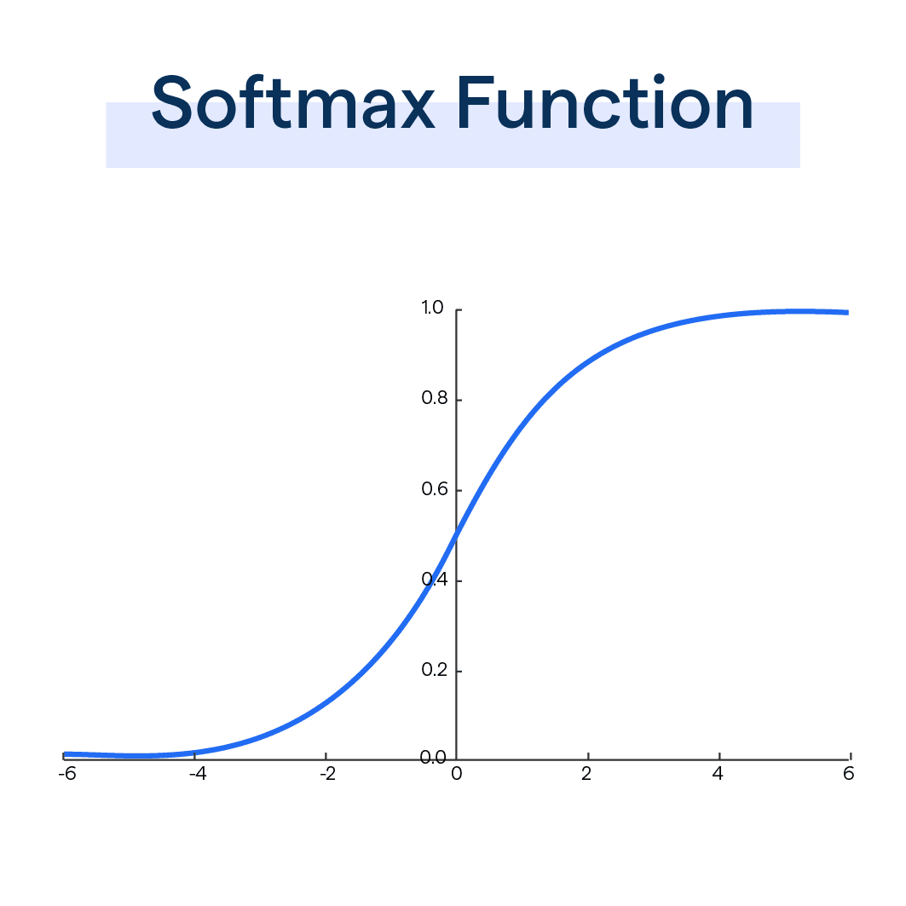

# Softmax

## Use case
Multi-class classification problem. Because all outputs are between 0 and 1, and sum up to 1. It converts a vector of raw prediction scores (i.e. logits) into probabalities.

## Pros and Cons
### pros
* with exponential, it emphasizes the difference between logits: even a slight increase in a logit value leads to a larger probability, while small logits result in near-zero probabilities
* differentiable - can be integrated into backpropagation using gradient descent 

### cons
* with exponential, large disparities in logits can dominate the output, making Softmax sensitive to outliers and noisy data
* overflow
* small probabilities can cause very small gradients during backpropagation, slowing down learning
* softmax may assign high probabilities to incorrect classes, leading to overly confident predictions
* not suited for mult-label tasks (not multi-class!), where an instance can belong to multiple classes
* the required exponential and normalization make it computationally expensive for large dataset or many classes

## Definition (concept)
Intention of the formula: (1) exagerate the the difference (at nominator), (2) normalization (at denominator)

"max": it is an better approximation of the max function max(0, x)
"soft": it softens sharp corner of hardmax (where x=0), making it differentiable

## Definition (math)

$$
    Softmax(z_i) = \frac{e^{z_i}}{\sum_{j=1}^{K}(e^{z_j})}
$$

$$z_{i}$$: is the logit (the output of the previous layer in the network) for the $$i^{th}$$ class.
$$K$$ is the number of classes.

## What does it look like

## Heursitics
* often used together with cross-entropy loss

$$
	Loss = −\sum y_{i} * log(p_{i})
$$

$$y_{i}$$ is the true label (1 for the correct class, 0 for others),
$$p_i$$ is the predicted probability for class i from the Softmax function.

Conceptually: it penalize the network if the predicted probability for the correct class is low.

* when K=2, it will be a Logistic function

## Minimal Implementation
* pytorch

* tensorflow
